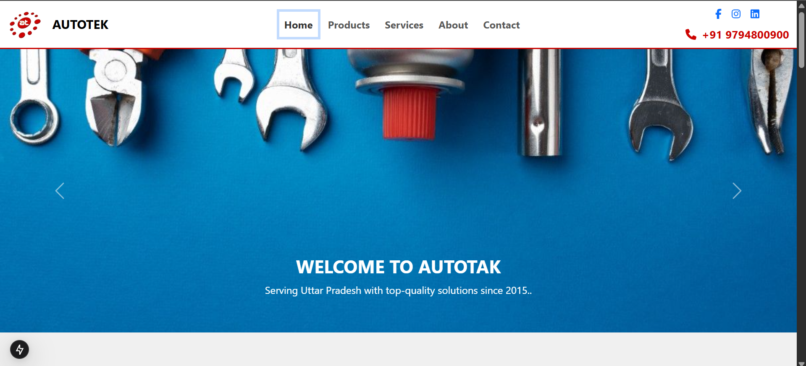
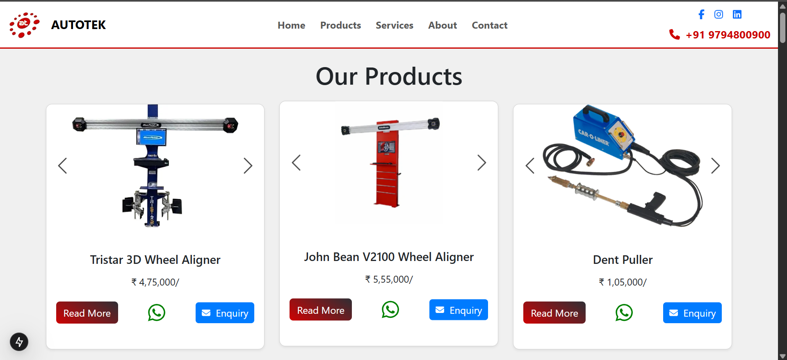

# Autotekworld

A static website for showcasing Autotekworld, built with HTML, CSS, JavaScript, and Bootstrap, Tailwind CSS, Next.js.

## 🚀 Features

- Clean, responsive layout
- Informative sections about the business
- Carousel and interactive UI
- Optimized for performance

## 🔧 Technologies Used

- HTML
- CSS
- JavaScript
- Bootstrap
- Next.js
- Tailwind CSS

## 🖼️ Demo

